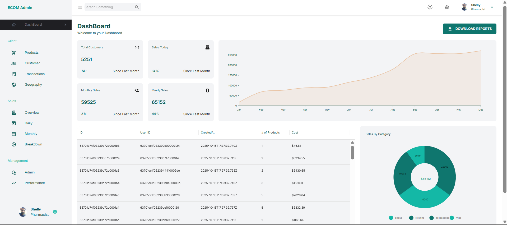
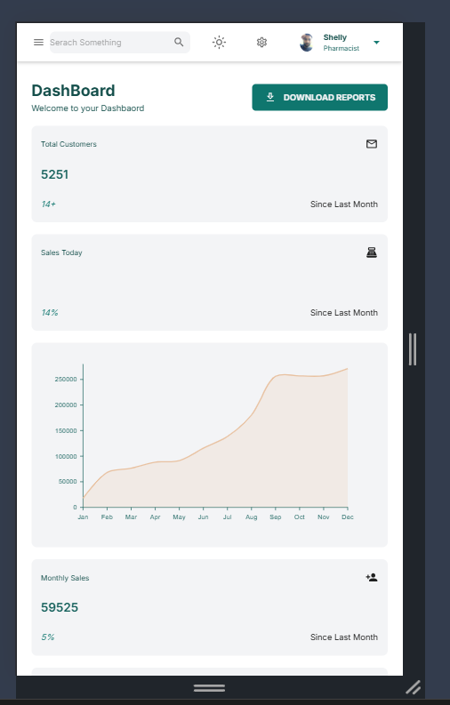
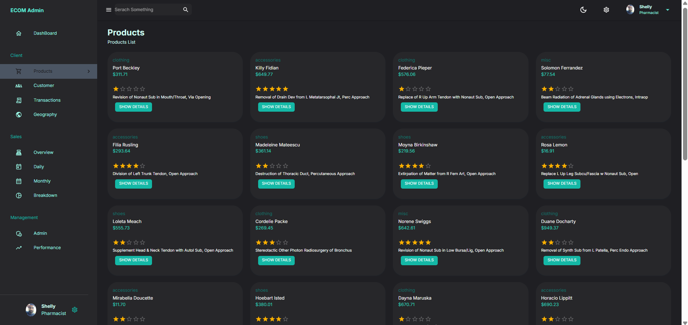
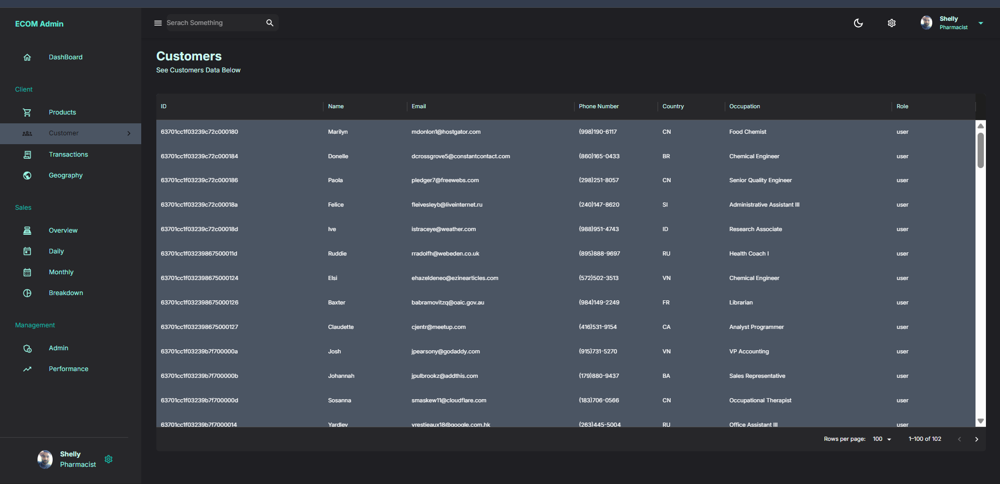
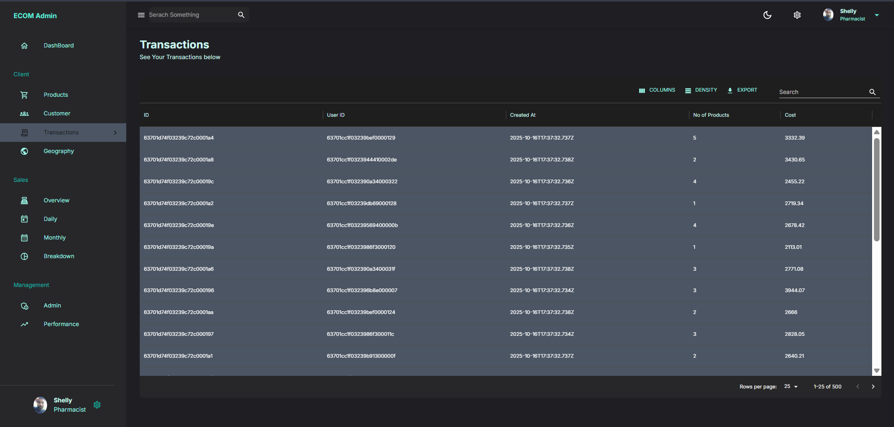
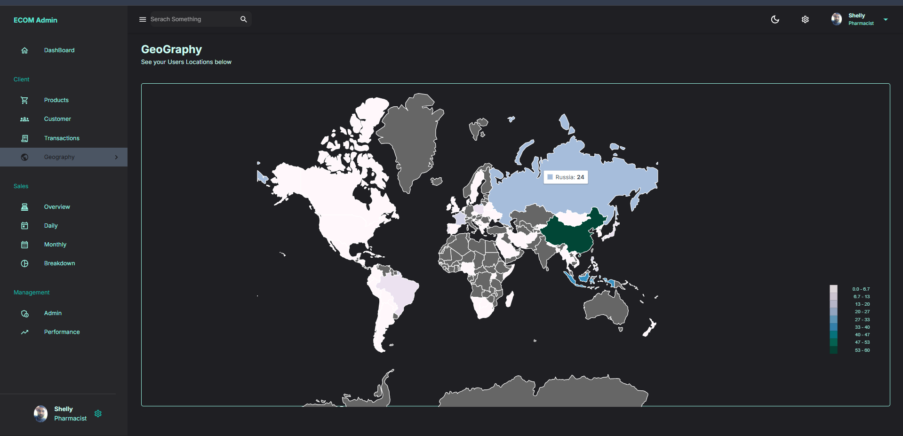
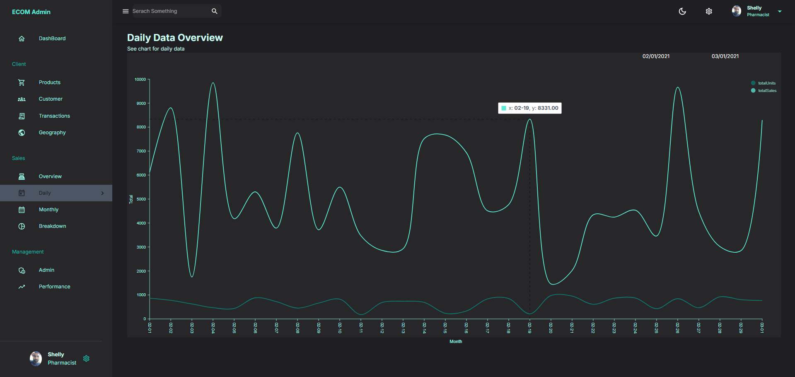
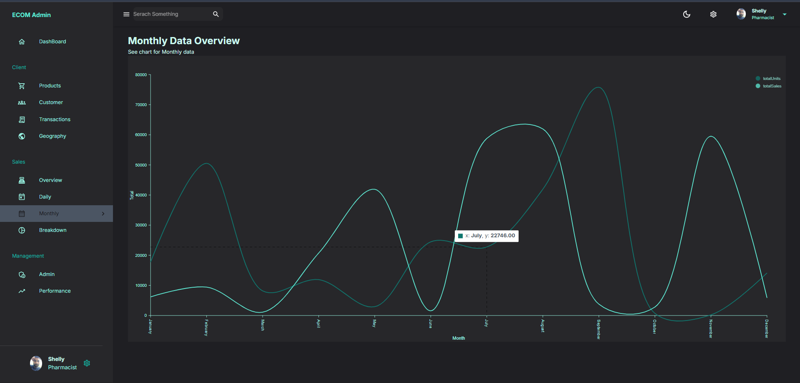
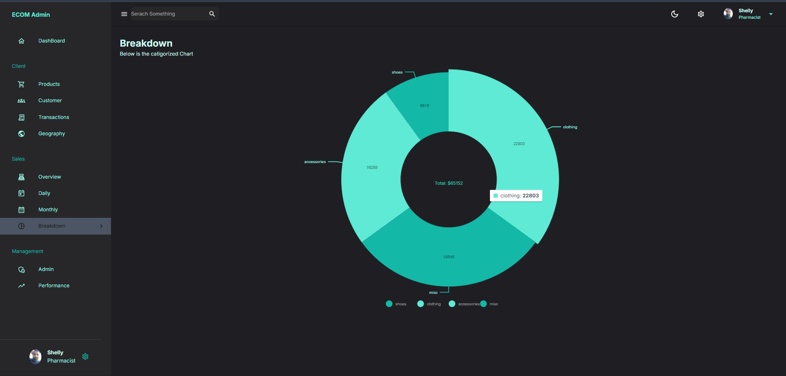

# AdminBoard - Full Stack MERN Admin Dashboard

A production‑ready **Admin Dashboard** built with the **MERN stack** (MongoDB, Express, React, Node.js).  
It provides analytics, customer & product management, transactions, performance metrics, and data visualizations.


---

## 🎯 Features

- 📊 **Dashboard Analytics** – Sales, revenue, performance & KPIs
- 🛒 **Product Management** – Inventory listing and stats
- 💳 **Transaction Tracking** – View and filter transactions
- 👥 **Customer Management** – Users and affiliate performance
- 🌍 **Geography Insights** – Sales by region
- 🌙 **Dark / Light Mode** – Theme switching and persistence
- 📈 **Charts & Graphs** – Pie charts, bar graphs & grids

---

## 🛠️ Technology Stack

### **Frontend**

- React 18 (functional components & hooks)
- Material UI (MUI) for UI components & DataGrid
- Axios for API requests
- CSS Modules for layout styling

### **Backend**

- Node.js
- Express.js (REST API)
- MongoDB + Mongoose (data models & queries)

### **Development Tools**

- Vite (React build tool)
- Git & GitHub
- Thunder Client / Postman (API testing)
- MongoDB Compass

---

## 📁 Project Structure

```
admindashboard/
├── client/              # React Frontend
│   ├── src/
│   │   ├── components/  # UI components (Header, Sidebar, Charts)
│   │   ├── pages/       # Dashboard pages (Products, Customers, etc.)
│   │   ├── requests/    # API calls
│   │   ├── states/      # Global state / theme logic
│   │   └── App.jsx
│   └── vite.config.js
|
└── server/              # Express Backend API
    ├── models/          # MongoDB schema definitions
    ├── controllers/     # Business logic
    ├── routes/          # API endpoints
    ├── config/          # Database connection
    └── server.js
```

---

## 🚀 Installation & Setup

### Prerequisites

- Node.js 16+
- MongoDB 6+
- pnpm or npm

---

### **Backend Setup**

```bash
cd server
pnpm install
pnpm start
# Server runs on http://localhost:5000
```

---

### **Frontend Setup**

```bash
cd client
pnpm install
pnpm run dev
# Client runs on http://localhost:5173
```

---

### **Environment Variables**

Create `.env` inside the server folder:

```
MONGO_URI=<your_mongo_connection_string>
PORT=5000
```

---

## 📡 API Overview

| Route           | Purpose                  |
| --------------- | ------------------------ |
| `/general/*`    | Dashboard analytics      |
| `/management/*` | Customers & products     |
| `/sales/*`      | Sales & performance data |

---

## 🧠 Architecture Flow

```
React UI (client)
   ↓ Axios Requests
Express Routes (server)
   ↓ Controllers
MongoDB Models
   ↓ JSON Response
React updates UI
```

---

## 📸 Screenshots

### DashBoard


### DashBoard (Light)



### Mobile View



### Products Cards



### Customers



### Transactions



### Geo Chart



### Daily Sales Line



### Monthly Sales Chart



### OverAll Breakdown Pie Chart



## 📝 Author

**Ansar Gigyani**

---

## 📜 License

MIT License
